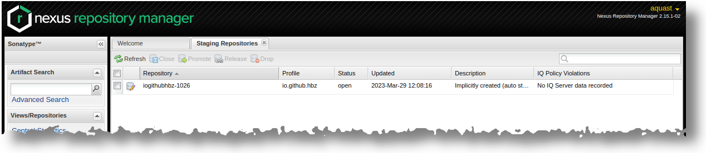
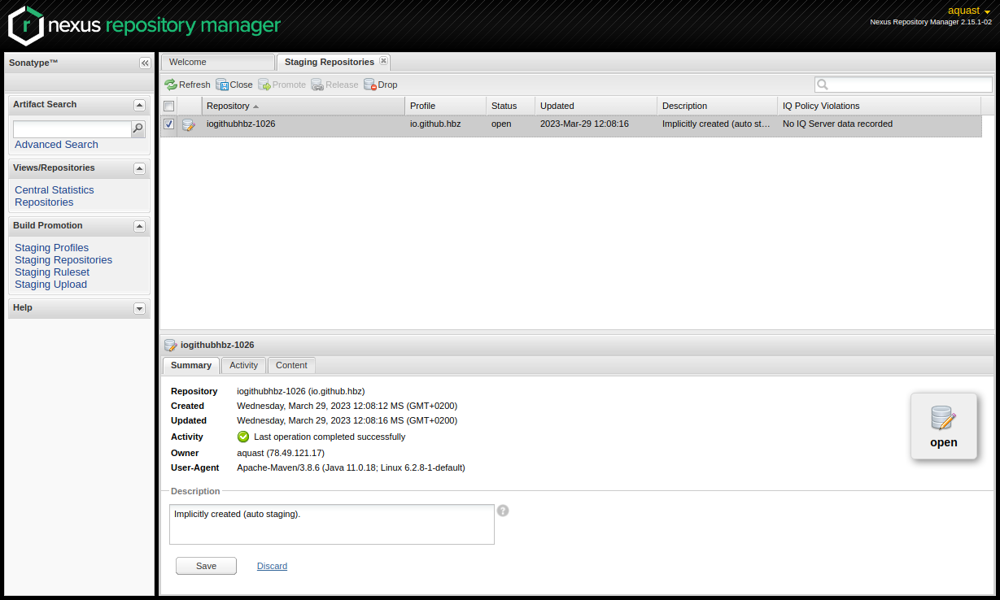
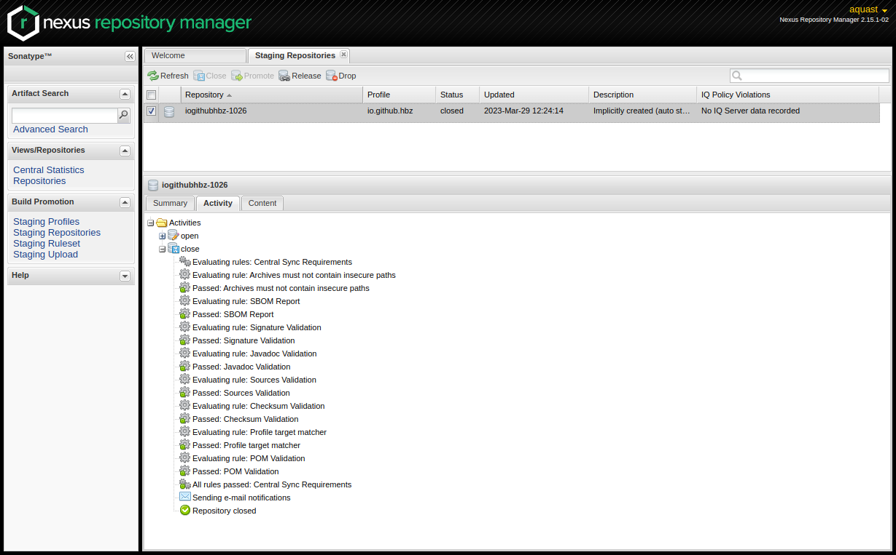

Publish to Maven Central
========================

For publishing the most recent versions of **to.science.core** at Maven Central we use the Sonatype OSSRH (OSS Repository Hosting) as it is a rather lightweight way to publish artifacts at `Maven Central <https://mvnrepository.com/artifact/io.github.hbz/to.science.core>`_.

The complete documentation how to publish artifacts at sonatype can be found `here <https://central.sonatype.org/publish/publish-guide/>`_

For Uploading and publishing Source Code at Maven Central you need to create a Sonatype Account via the Sonatype Jira. 

With that account you can either create our own repositories at OSSRH or ask any repository owner for granting access to her/his repositories 

After the access is granted for publishing at **to.science.core** you should be able to release and publishing a new **to.science.core** release at Maven Central. Do that by the following steps:

1. Update the version number of the to.science.core artifact within the the to.science.core pom.xml 
___________________________________________________________________________________________________

Although it's possible, please **do not** provide a SNAPSHOT-Version

.. code-block:: xml

   <project xmlns="http://maven.apache.org/POM/4.0.0" xmlns:xsi="http://www.w3.org/2001/XMLSchema-instance"   xsi:schemaLocation="http://maven.apache.org/POM/4.0.0 https://maven.apache.org/xsd/maven-4.0.0.xsd">
	<modelVersion>4.0.0</modelVersion>

	<groupId>io.github.hbz</groupId>
	<artifactId>to.science.core</artifactId>
	<version>1.3.4</version>
	<packaging>jar</packaging>

	<name>Toolbox Open Science Core</name>
 

2. Deploy your release to the OSSRH by executing maven with some special goals
______________________________________________________________________________

.. code-block:: shell
   
  $ mvn clean source:jar javadoc:javadoc javadoc:jar verify gpg:sign deploy

If succesfull you should see somethimg like that:

.. code-block:: shell

  [INFO] Installing /home/aquast/git/to.science.core/target/to.science.core-1.3.4-javadoc.jar.asc to /home/aquast/.m2/repository/io/github/hbz/to.science.core/1.3.4/to.science.core-1.3.4-javadoc.jar.asc
  [INFO] 
  [INFO] --- maven-deploy-plugin:2.7:deploy (default-deploy) @ to.science.core ---
  Uploading to ossrh: https://s01.oss.sonatype.org/service/local/staging/deploy/maven2/io/github/hbz/to.science.core/1.3.4/to.science.core-1.3.4.jar
  Uploaded to ossrh: https://s01.oss.sonatype.org/service/local/staging/deploy/maven2/io/github/hbz/to.science.core/1.3.4/to.science.core-1.3.4.jar (109 kB at 15 kB/s)
  Uploading to ossrh: https://s01.oss.sonatype.org/service/local/staging/deploy/maven2/io/github/hbz/to.science.core/1.3.4/to.science.core-1.3.4.pom
  Uploaded to ossrh: https://s01.oss.sonatype.org/service/local/staging/deploy/maven2/io/github/hbz/to.science.core/1.3.4/to.science.core-1.3.4.pom (5.8 kB at 7.1 kB/s)
  Downloading from ossrh: https://s01.oss.sonatype.org/service/local/staging/deploy/maven2/io/github/hbz/to.science.core/maven-metadata.xml
  Uploading to ossrh: https://s01.oss.sonatype.org/service/local/staging/deploy/maven2/io/github/hbz/to.science.core/maven-metadata.xml
  Uploaded to ossrh: https://s01.oss.sonatype.org/service/local/staging/deploy/maven2/io/github/hbz/to.science.core/maven-metadata.xml (308 B at 338 B/s)
  Uploading to ossrh: https://s01.oss.sonatype.org/service/local/staging/deploy/maven2/io/github/hbz/to.science.core/1.3.4/to.science.core-1.3.4-sources.jar
  Uploaded to ossrh: https://s01.oss.sonatype.org/service/local/staging/deploy/maven2/io/github/hbz/to.science.core/1.3.4/to.science.core-1.3.4-sources.jar (100 kB at 89 kB/s)
  Uploading to ossrh: https://s01.oss.sonatype.org/service/local/staging/deploy/maven2/io/github/hbz/to.science.core/1.3.4/to.science.core-1.3.4-javadoc.jar
  Uploaded to ossrh: https://s01.oss.sonatype.org/service/local/staging/deploy/maven2/io/github/hbz/to.science.core/1.3.4/to.science.core-1.3.4-javadoc.jar (547 kB at 297 kB/s)
  Uploading to ossrh: https://s01.oss.sonatype.org/service/local/staging/deploy/maven2/io/github/hbz/to.science.core/1.3.4/to.science.core-1.3.4.jar.asc
  Uploaded to ossrh: https://s01.oss.sonatype.org/service/local/staging/deploy/maven2/io/github/hbz/to.science.core/1.3.4/to.science.core-1.3.4.jar.asc (488 B at 1.6 kB/s)
  Uploading to ossrh: https://s01.oss.sonatype.org/service/local/staging/deploy/maven2/io/github/hbz/to.science.core/1.3.4/to.science.core-1.3.4.pom.asc
  Uploaded to ossrh: https://s01.oss.sonatype.org/service/local/staging/deploy/maven2/io/github/hbz/to.science.core/1.3.4/to.science.core-1.3.4.pom.asc (488 B at 1.5 kB/s)
  Uploading to ossrh: https://s01.oss.sonatype.org/service/local/staging/deploy/maven2/io/github/hbz/to.science.core/1.3.4/to.science.core-1.3.4-sources.jar.asc
  Uploaded to ossrh: https://s01.oss.sonatype.org/service/local/staging/deploy/maven2/io/github/hbz/to.science.core/1.3.4/to.science.core-1.3.4-sources.jar.asc (488 B at 1.7 kB/s)
  Uploading to ossrh: https://s01.oss.sonatype.org/service/local/staging/deploy/maven2/io/github/hbz/to.science.core/1.3.4/to.science.core-1.3.4-javadoc.jar.asc
  Uploaded to ossrh: https://s01.oss.sonatype.org/service/local/staging/deploy/maven2/io/github/hbz/to.science.core/1.3.4/to.science.core-1.3.4-javadoc.jar.asc (488 B at 1.3 kB/s)
  [INFO] ------------------------------------------------------------------------
  [INFO] BUILD SUCCESS
  [INFO] ------------------------------------------------------------------------
  [INFO] Total time:  25.454 s
  [INFO] Finished at: 2023-03-29T12:08:23+02:00
  [INFO] ------------------------------------------------------------------------
 

3. To proceed log-in to the NEXUS Webinterfaces staging Repositories section
____________________________________________________________________________

Within a Browser go to the URL https://s01.oss.sonatype.org/#stagingRepositories . 
You will be asked to log-in and directed to the stagingRepository-section.
There you now should be able to find your uploaded artifact as a "repository". Unfortunately the naming of the repository is not "that" straight forward if you are a human being. 

4. Mark youre artifact and proceed with the button "close"
__________________________________________________________ 

After marking the artifact the buttons 'Close' and 'Drop' will become available for you. You can either proceed with publishing by clicking the 'Close' button or abort the workflow and clear the staging queue by clicking 'Drop'.
 
If you proceed with 'Close' the Nexus Repository Manager will check your artifact if it's ready for releasing (and publishing) to Maven Central.

By clicking Refresh you can follow the detailed steps to be processed.

 
5. Last step: Release your artifact to Maven Central
____________________________________________________

If all closing steps are done successfully, the 'Release' button will become available for you. By clicking 'Release' you will release and publish your artifact to Maven Central. Additionally the artifact will be removed from the stagingRepositories section.

It can take some time (in minuites or hours) until you can see your artifact at the Maven Central Searches. Nevertheless the artifact should be already accessible for beeing imported via pom.xml or build.sbt 
 

