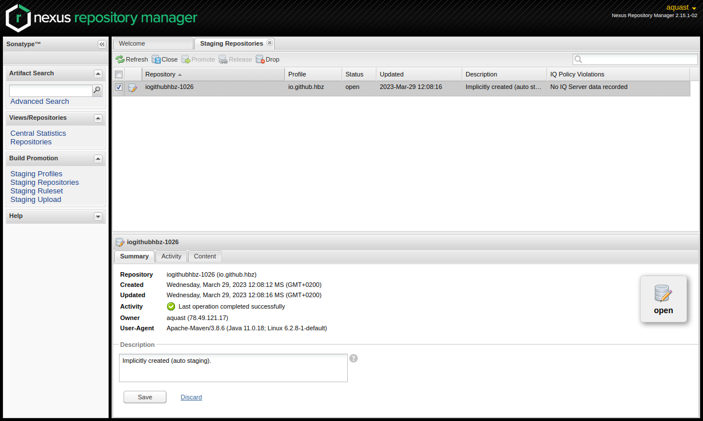

Code auf Maven Central publizieren
==================================

Um die aktuellste Version von **to.science.core** als `Artefakt <https://mvnrepository.com/artifact/io.github.hbz/to.science.core>`_ über die `Maven Central Infrastruktur <https://mvnrepository.com>`_ verfügbar zu machen und damit die Einbindung der Java-Bibliothek in andere Projekte zu fördern, wird an dieser Stelle das Sonatype OSSRH (Open Source Software Repository Hosting) verwendet.

Die vollständige Beschreibung, wie Artefakte im OSSRH publiziert werden, findet sich `hier <https://central.sonatype.org/publish/publish-guide/>`_. Die folgende Beschreibung ist für das Publishing eigener Beiträge zu **to.science.core** gedacht.

Das direkte Publishing bei OSSRH wird für dieses Projekt vom hbz reglementiert und setzt eine gewisse Erfahrung mit Beiträgen zu Software-Projekten voraus. 

Voraussetzungen
_______________

Zunächst muss über diesen `Link <https://issues.sonatype.org/secure/Signup!default.jspa>`_ ein eigener Account im Sonatype-Jira angelegt werden. benötigt, der zugleich als Account für das OSSRH fungiert. 

Als nächstes ist es notwendig, dass wir den Account innerhalb des OSSRH für das Projekt freigeben. Bitte per E-Mail anfragen. 

Weitere Vorbereitungen
______________________

1. GPG-Signing einrichten
-------------------------

Die hochzuladenden Artefakte müssen mit einen GPG-Schlüssel signiert werden. Die pom.xml ist soweit vorbereitet, dass ein bereits vorhandener PGP-Schlüssel eingesetzt werden kann. Sollte bisher kein eigener GPG-Schlüssel vorhanden sein, ist bei Sonatype eine `detaillierte Anleitung <https://central.sonatype.org/publish/publish-maven/#gpg-signed-components>`_ zu finden. Über die vorbereitete ``pom.xml`` und eine nutzerspezifische Datei ``settings.xml`` innerhalb des Maven-Verzeichnisses (unter Linux ``/home/user/.m2/settings.xml``) kann der Schlüsselaufruf automatisiert werden. Dafür wird mit dem gpg-Kommando ermittelt, welcher eigene Schlüssel verwendet werden soll.

.. code-block:: shell
  
   $ gpg --list-signatures --keyid-format 0xshort
 

Anschließend wird die settings.xml in der profiles-Sektion erweitert.

.. code-block:: xml

   <profiles>
    <profile>
      <id>ossrh</id>
      <activation>
        <activeByDefault>true</activeByDefault>
      </activation>
      <properties>
        <gpg.executable>gpg2</gpg.executable>
        <gpg.keyname>0xXXXXXXXX</gpg.keyname>
        <gpg.passphrase>KlartextPasswort</gpg.passphrase>
      </properties>
    </profile>
  </profiles>

In gpg.executeable wird das verwendete gpg-Kommandozeilentool eingetragen, in gpg.keyname der vorher über die Zeile ``sig 3`` ermittelte Key eingetragen. In gpg.passphrase steht das Passwort für den privaten Schlüssel im Klartext, weshalb es sinnvoll ist, für diesen Anwendungsfall ein eignenes GPG-Schlüsselpaar zu generieren, das bei Bedarf einfacher zurückgezogen werden kann. 

2. settings.xml für automatischen Upload anpassen
-------------------------------------------------

In der vorgenannten ``settings.xml`` Datei kann nun noch in der servers-Section der Server OSSRH vereinbart werden, damit der Upload auch ohne weitere Interaktion möglich ist. 

.. code-block:: xml

 <servers>
    <server>
      <id>ossrh</id>
      <username>Nutzername</username>
      <password>KlartextPasswort</password>
    </server>
  </servers>

Auch hier sei nochmal explizit darauf hingewiesen, dass das Passwort für den Account im Klartext abgelegt wird.

Hands On!
_________

Nachdem obige Vorbereitungen erledigt wurden, sollte es nun möglich sein, mit dem folgenden Vorgehen neue Versionen (Artefakte) von **to.science.core** selbstständig zu publizieren.   

1. Die Versionsnummer innerhalb der zu to.science.core gehörenden pom.xml erhöhen 
---------------------------------------------------------------------------------

Dieser Schritt ist wichtig, damit eine bestehende Artefakt-Version nicht mit der Neuen überschrieben wird. Anmerk. bisher ist mir unklar, ob das überhaupt im OSSRH möglich ist.

Bitte unbedingt das Publizieren von SNAPSHOT-Releases vermeiden, um die Code-Qualität zu sichern. 

.. code-block:: xml

   <project xmlns="http://maven.apache.org/POM/4.0.0" xmlns:xsi="http://www.w3.org/2001/XMLSchema-instance"   xsi:schemaLocation="http://maven.apache.org/POM/4.0.0 https://maven.apache.org/xsd/maven-4.0.0.xsd">
	<modelVersion>4.0.0</modelVersion>

	<groupId>io.github.hbz</groupId>
	<artifactId>to.science.core</artifactId>
	<version>1.3.4</version>
	<packaging>jar</packaging>

	<name>Toolbox Open Science Core</name>
 

2. Mittels geeigneter Maven Goals das Artefakt erstellen und direkt zu OSSRH hochladen
--------------------------------------------------------------------------------------

Innerhalb des mit git erstellten lokalen **to.science.core** Verzeichnis wird folgender Maven-Befehl aufgerufen 

.. code-block:: shell
   
  $ mvn clean source:jar javadoc:javadoc javadoc:jar verify gpg:sign deploy

If succesfull you should see somethimg like that:

.. code-block:: shell

  [INFO] --- maven-deploy-plugin:2.7:deploy (default-deploy) @ to.science.core ---

  [...]

  Uploaded to ossrh: https://s01.oss.sonatype.org/service/local/staging/deploy/maven2/io/github/hbz/to.science.core/1.3.4/to.science.core-1.3.4-javadoc.jar.asc (488 B at 1.3 kB/s)
  [INFO] ------------------------------------------------------------------------
  [INFO] BUILD SUCCESS
  [INFO] ------------------------------------------------------------------------
  [INFO] Total time:  25.454 s
  [INFO] Finished at: 2023-03-29T12:08:23+02:00
  [INFO] ------------------------------------------------------------------------
 

3. Weitere Schritte im NEXUS Web-Interface durchführen
------------------------------------------------------

Nun kann mit einem Browser das Web-Interface unter https://s01.oss.sonatype.org/#stagingRepositories aufgerufen werden. Dabei wird nach dem Log-In mit den Sonatype-ZUgangsdaten gefragt. 

Innerhalb des stagingRepositories-Bereichs sollte das gerade hochgeladene Artefakt aufgelistet sein. Leider wird das Artefakt unter einem eher kryptischen Namen angezeigt, so dass bei mehreren vorhandenen Artefakten eine genaue Prüfung nötig ist, welches das eigene ist.  

.. image:: ../resources/images/nexus-staging.png
   :scale: 70
   :alt: alternate text
   :align: left

4. Das Artefakt auswählen und schließen
--------------------------------------- 

Nachdem das Artefakt über das Auswahlkästchen links ausgewählt wurde, wird der Button "Close" verfügbar. Der Button ist nun zu klicken. Das Schließen ist ein notwendiger Schritt, bei dem der hochgeladene Inhalt auf Vollständigkeit etc. geprüft wird. 

Über den "Refresh"-Button lässt sich im unteren Reiter "Action" der Fortschritt verfolgen.  

 
5. Letzter Schritt: Release
---------------------------

Nachdem das Schließen erfolgreich abgeschlossen ist, wird der Button "Release" verfügbar. Wenn er gedrückt wird, wird das Artefakt zum Maven Central Repository hochgeladen und publiziert. Zugleich wird es aus dem stagingRepositories-Bereich entfernt. 

.. image:: ../resources/images/nexus-closed.png
   :scale: 70
   :alt: alternate text
   :align: left

Es kann jetzt eine Weile dauern, bis das neue Artefakt in der Repository-Suche sichtbar wird. Dennoch ist das neue Artefakt über die Versionsnummer bereits in die pom.xml oder build.sbt abrufbar. 
 

